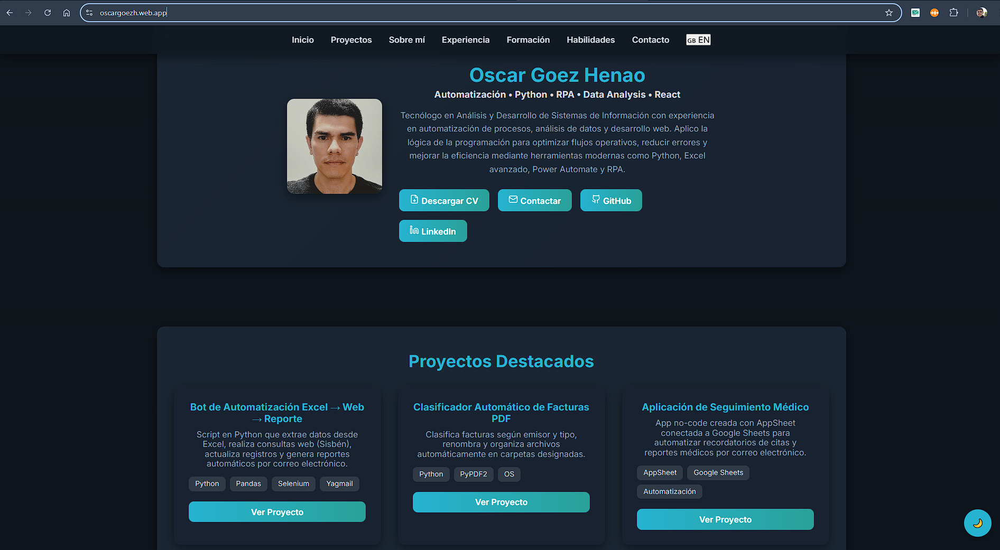

# 👨‍💻 Oscar Goez Henao – Portafolio Web

Bienvenido a mi portafolio profesional desarrollado con **React**. Aquí presento mis proyectos, habilidades y experiencia en desarrollo web, automatización de procesos y análisis de datos.

## 🧠 Sobre mí

Tecnólogo en Análisis y Desarrollo de Sistemas de Información con experiencia en automatización de procesos, análisis de datos y desarrollo web. Aplico la lógica de la programación para optimizar flujos operativos, reducir errores y mejorar la eficiencia mediante herramientas modernas como **Python**, **Excel avanzado**, **Power Automate** y **RPA**.

## 🚀 Tecnologías utilizadas

- React
- JavaScript (ES6+)
- HTML5 & CSS3
- Responsive Design
- Git & GitHub

## 🌐 Proyecto en línea

Puedes ver el portafolio desplegado aquí:  
🔗 [oscargoezh.web.app](https://oscargoezh.web.app/)

Repositorio en GitHub:  
📁 [github.com/oscargoezh/portafolio](https://github.com/oscargoezh/portafolio)

## 📸 Vista previa

> Reemplaza la ruta anterior con la URL o ruta local de tu imagen o GIF.

## 📬 Contacto

- 📧 oscargoezhenao@gmail.com  
- 💼 [LinkedIn](https://www.linkedin.com/in/oscargoezh) *(si tienes uno, agrégalo)*
- 🐙 [GitHub](https://github.com/oscargoezh)

